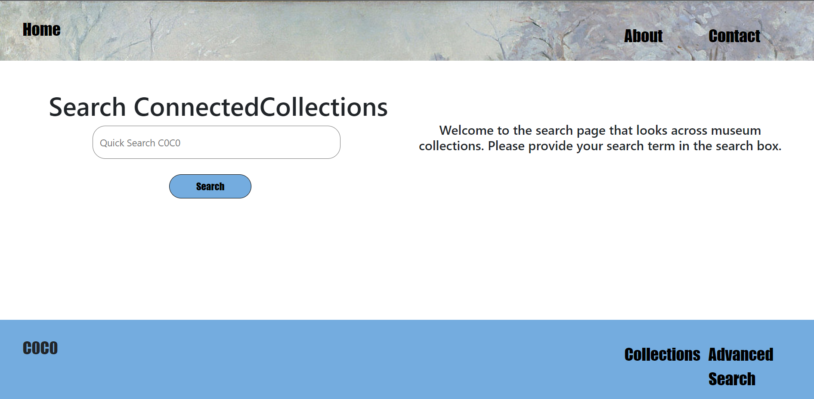
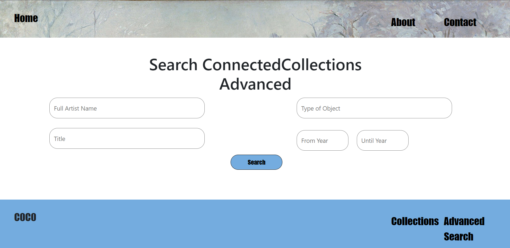
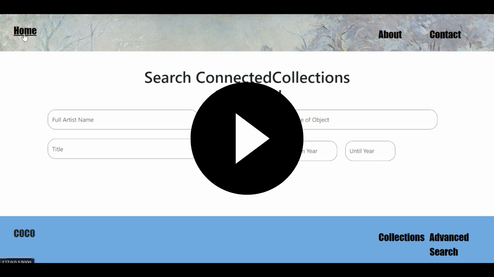

# C0C0
Application/Project Name: "C0C0" or "Connected Collections"

By: Camiel de Kom

Project Goal: The purpose of the web application is to provide a way to search multiple museum collections simultaneously, connecting collections across the world.

Home and Search page

Advanced Search page

Screencast

## Functionality
Within the web application the user can search the Rijksmuseum and Cleveland Museum of Art collection, simultaneously. This can be done through two different pages: the Search page and Advanced Search page (please find screenshots of both above). The normal search page serves as a quick search and can come up with related results to your search term, along the more direct results. Furthermore, the advanced search page requires the full name of the artist in order to come up with the most accurate results. The rest of the fields are optional, but can enhance the precision of the search results with the two museum collections. Last, the other pages are present to provide other information about the project or other related themes. the latter pages are static.

## Getting Started
To get the application running you will only need Django!

## References and sources used for extra explanation
- Image of Claude Monet - The Magpie, is in the public domain.
- https://www.w3schools.com/ for information about CSS, Python, HTML, Django and zip().
- https://docs.djangoproject.com/en/4.1/ref/templates/builtins/ for information about the usage of a.o. loops and if statements within HTML files. Especially used for the display of the search results (both pages), together with some information on Stack Overflow (which is cited in the code itself).
- https://data.rijksmuseum.nl/object-metadata/api/ for information about the Rijksmuseum API, and how it works, such as examples.
- https://openaccess-api.clevelandart.org/#appendix-a for information about the Cleveland Museum of Art API, and how it works, such as examples. This page includes an explanation for how to extract data from a response in Python. I based my code upon this explanation, but did not literally copy its content. (these fragments can be found in Util.py)
- Base code to get the app working was provided by Django upon initiation of the app.
- Last, I made use of the Bootstrap library, available at https://getbootstrap.com/, in my layout.html.
